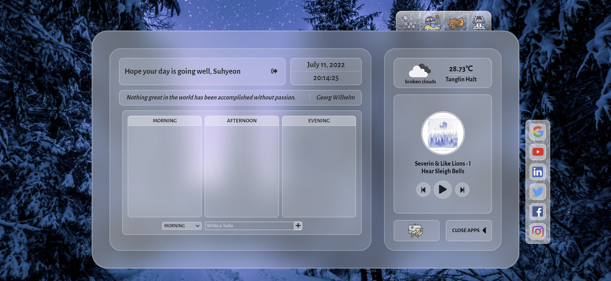

# Momentum

Personal dashboard web application developed with JavaScript

Demo: https://momentum-my-dashboard.netlify.app/

## Buit with

### Front-end

- HTML5
- CSS3
- JavaScript

### Deploy

- Netlify

## Features

- Real-Time Clock
  - Display current date and time
- Quotes
  - Display random quote
- To Do List
  - Organize to-do list by time of day
  - Create/complete/delete tasks
- Background Change
  - Provide a seasonal icon bar in the upper right corner of the dashboard
  - When the user clicks on one of the seasonal icons, the background image changes.
- Weather
  - Display weather information and geolocation based on user location
- Music player
  - Display current music information
  - Play/stop music
  - Play next/previous music
- Canvas
  - Draw on canvas
  - Save the image as PNG
- Apps
  - Provide shortcut icons on the apps bar
